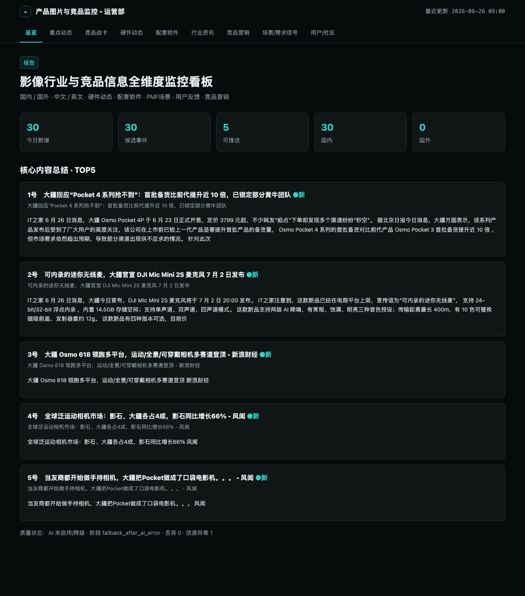
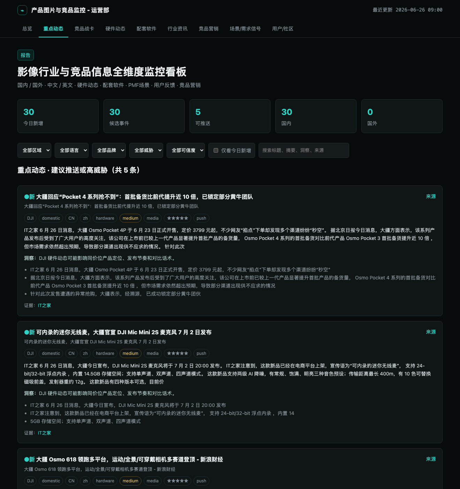
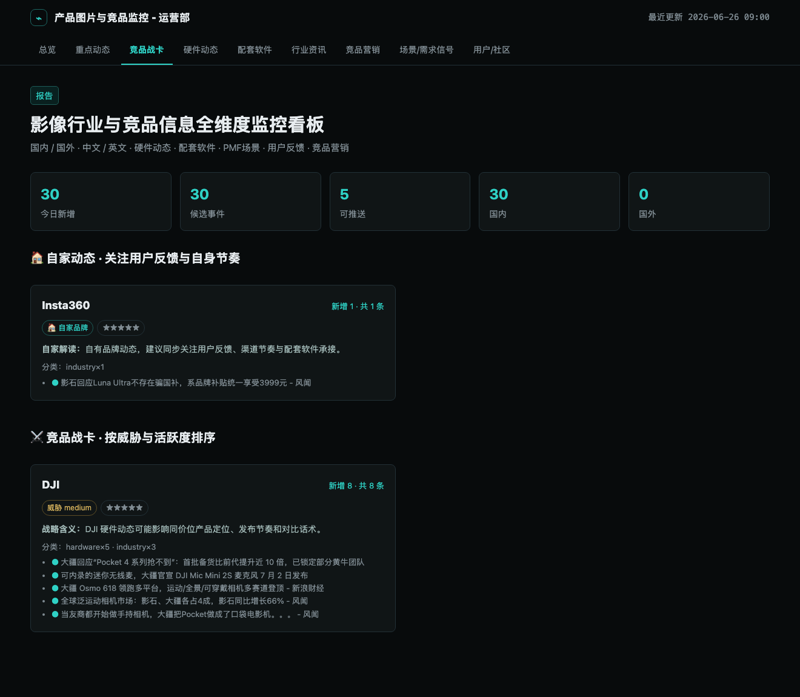
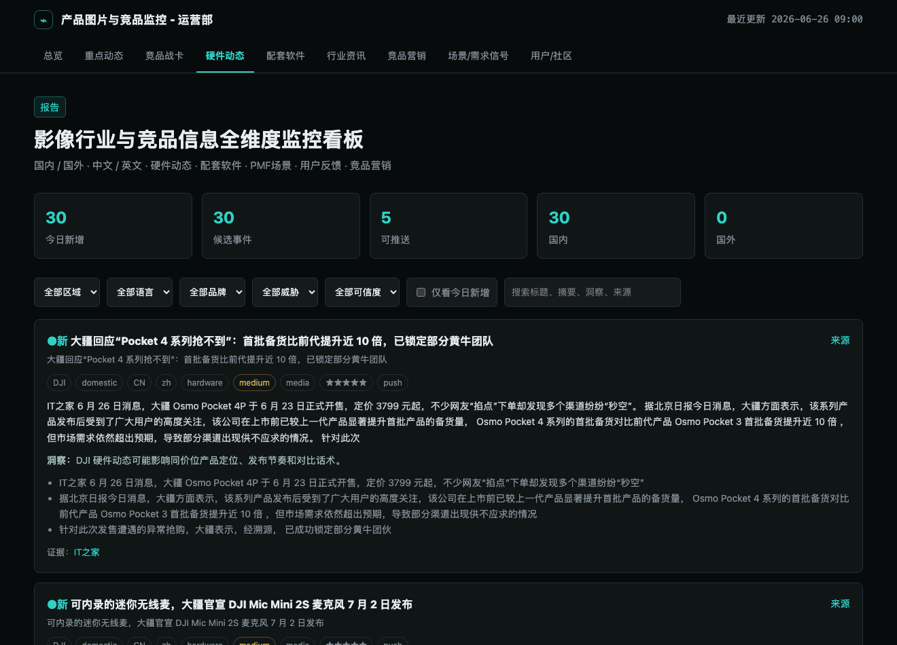

# Imaging Monitor

AI-native imaging competitor and market monitoring with deterministic source collection, structured AI extraction, Feishu push alerts, and a static dashboard.

This repository is designed to be lightweight and demo-friendly:

- No third-party runtime dependencies
- GitHub Actions as the default scheduler
- `data/` kept in git on purpose for dashboard demos and cross-run memory
- Works with OpenAI-compatible APIs, Anthropic APIs, and internal gateways

## What It Does

- Collects imaging-related signals from domestic and global sources
- Filters noise before sending candidates to AI
- Extracts Chinese summaries, evidence links, threat level, and strategic insight
- Deduplicates across runs so the same story is not repeatedly pushed
- Generates:
  - `data/events.json`
  - `data/report.json`
  - `data/quality_report.json`
  - `data/store.json`
- Pushes new high-value items to Feishu
- Renders a static dashboard from the JSON outputs

## Quick Start

```bash
cd imaging-monitor
cp .env.example .env
python3 tests/run_all.py
python3 -m imaging_monitor.cli run --fixture-dir tests/fixtures --dry-run --skip-push --no-ai
python3 -m http.server 8000
```

Open:

```text
http://localhost:8000/web/
```

On macOS you can also double-click `start.command`.

## Common Commands

```bash
# Offline fixture run
python3 -m imaging_monitor.cli run --fixture-dir tests/fixtures --dry-run --skip-push --no-ai

# Full local tests
python3 tests/run_all.py

# AI connectivity check
python3 -m imaging_monitor.cli ping-ai

# Real-source dry run without sending Feishu
python3 -m imaging_monitor.cli run --dry-run --skip-push

# Send the latest card from data/report.json
python3 -m imaging_monitor.cli send --dry-run
python3 -m imaging_monitor.cli send
```

## AI Configuration

The project supports two API families:

- `AI_PROVIDER=openai-compatible`
  For DeepSeek, OpenAI, DashScope, OpenRouter, Moonshot, SiliconFlow, and most enterprise gateways
- `AI_PROVIDER=anthropic`
  For Claude public APIs or enterprise gateways exposing Anthropic Messages API

Recommended DeepSeek setup:

```bash
AI_PROVIDER=openai-compatible
AI_BASE_URL=https://api.deepseek.com/v1
AI_MODEL=deepseek-chat
AI_WIRE_API=chat
AI_API_KEY=sk-...
```

More templates are in [.env.example](.env.example).

## Repository Layout

```text
imaging_monitor/   core pipeline
config/            sources and keyword config
tests/             smoke tests and regression tests
web/               static dashboard
docs/              screenshots, sample cards, background docs
data/              generated outputs kept for demos and history
```

Main entry point:

[imaging_monitor/cli.py](imaging_monitor/cli.py)

## Data Policy

The `data/` directory is intentionally versioned.

It serves two purposes:

- Runtime outputs for the dashboard and Feishu card
- Demo artifacts and cross-run memory (`store.json`)

So although these files are generated, they are part of the product surface and should stay in the repository.

## Screenshots

| 总览 | 重点动态 |
|:---:|:---:|
|  |  |
| **竞品战卡** | **硬件动态** |
|  |  |

## Documentation

- [Project Background](docs/project-background.md)
- [Feishu Card Samples](docs/飞书卡片样例.md)
- [Demo Script](docs/演示脚本.md)
- `docs/screenshots/` dashboard screenshots

## CI

GitHub Actions:

- runs tests first
- runs the monitor on schedule
- commits updated `data/`
- deploys the static dashboard via GitHub Pages

Workflow file:

[.github/workflows/imaging-monitor.yml](.github/workflows/imaging-monitor.yml)

## License

[MIT](LICENSE)
